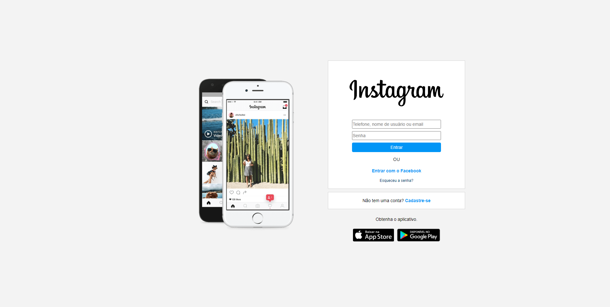

## Introdução

[Projeto Instagram](https://site-login-instagram.vercel.app/)

Este readme está dividido em:

- Introdução
- Descrição
- Funcionalidades
- Como instalar
- Imagem

## Descrição

Trata-se de uma cópia da página de login do Instagram desenvolvido em HTML 5 e CSS 3 para fins didáticos.

## Funcionalidades

O foco do projeto era apenas testar os conhecimentos de HTML 5 e CSS 3. Dessa forma, foram revistos conhecimentos antigos, e adquiridos conhecimentos novos, como a inserção do display flex e utilização do flex-direction para alinhamento em coluna, além da divisão da página em diferentes contêineres.

Também foi implementado o conceito de Media Queries, recurso do CSS 3 que permite a renderização de conteúdo para se adaptar a diferentes formatos de tela do usuário.

## Como instalar

Para instalar, basta baixar ou clonar o projeto e abrir o arquivo "index.html" em seu navegador favorito.
Porém, você também pode acessar o site do projeto [clicando aqui](https://site-login-instagram.vercel.app/)

## Imagem do Projeto

